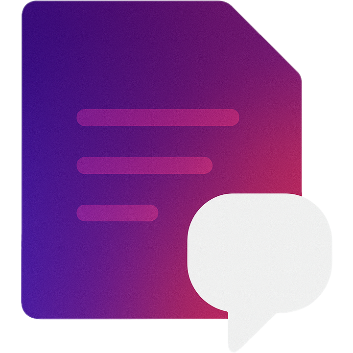

# Page LLM

A simple browser extension to chat with the current webpage using your own Google Gemini or OpenAI API key.



Page LLM allows you to leverage powerful large language models directly on any webpage. Use it to summarize long articles, explain complex topics, define terms, or ask any question about the page's content.

## Features

-   **Interact with Page Content**: Sends the text from the current page to an AI model along with your instructions.
-   **Bring Your Own API Key**: Securely use your personal Google or OpenAI API keys. Your keys are stored locally in your browser and never sent to a third-party server.
-   **Provider Choice**: Switch between Google Gemini and OpenAI models.
-   **Model Selection**: Choose from a curated list of modern, efficient models.
-   **Quick Prompts**: Get started quickly with pre-defined prompts for common tasks like summarizing or explaining concepts.
-   **Simple Interface**: A clean and intuitive popup UI for a seamless experience.

## Installation

You can install the extension in two ways: by using a pre-built package or by building it from the source code.

### Method 1: From a Pre-built Package (Recommended)

This is the easiest way to get started.

1.  Download the latest release package for your browser (e.g., `chrome-mv3.zip` or `firefox-mv3.zip`) from the project's **Releases** page or the `dist/` directory.
2.  Unzip the downloaded file into a dedicated folder.
3.  Follow the instructions for your browser:

    **For Google Chrome or Microsoft Edge:**
    -   Open your browser and navigate to `chrome://extensions`.
    -   Enable **Developer mode** using the toggle in the top-right corner.
    -   Click the **Load unpacked** button.
    -   Select the folder where you unzipped the extension.

    **For Mozilla Firefox:**
    -   Open Firefox and navigate to `about:addons`.
    -   Click the gear icon in the top-right and select **Debug Add-ons**.
    -   Click the **Load Temporary Add-on...** button.
    -   Select the `manifest.json` file inside the folder where you unzipped the extension.

The Page LLM icon should now appear in your browser's toolbar.

### Method 2: Building from Source

If you want to build the extension yourself, you'll need [Node.js](https://nodejs.org/) and a package manager like `npm` or `bun`.

1.  **Clone the repository:**
    ```bash
    git clone https://github.com/your-username/page-llm.git
    cd page-llm
    ```

2.  **Install dependencies:**
    ```bash
    npm install
    # or: bun install
    ```

3.  **Build the extension:**
    ```bash
    npm run build
    # or for Firefox: npm run build:firefox
    ```
    This command will create a build directory inside `.output/` (e.g., `.output/chrome-mv3`).

4.  **Load the extension** by following the "Load unpacked" or "Load Temporary Add-on" steps from Method 1, but point to the build directory (e.g., `.output/chrome-mv3`).

## How to Use

1.  **Configure Settings:**
    -   After installation, click the Page LLM icon in your toolbar. You may be directed to the options page, or you can right-click the icon and select "Options".
    -   Choose your preferred **AI Provider** (Google Gemini or OpenAI).
    -   Enter your **API Key** for the selected provider. You can click "SHOW" to verify it.
    -   Select a **Model** from the dropdown list.
    -   Click **Save Settings**.

2.  **Interact with a Page:**
    -   Navigate to any webpage you want to interact with.
    -   Click the Page LLM icon in the toolbar to open the popup.
    -   Type your instruction in the text box (e.g., "Summarize this article in three bullet points.").
    -   Alternatively, select a **Quick Prompt** from the dropdown to pre-fill the instruction box.
    -   Click the send button or press `Cmd+Enter` (Mac) / `Ctrl+Enter` (Windows).
    -   The AI's response will appear in the "Output" area. You can easily copy it to your clipboard using the copy button.

## Development

Interested in contributing? Here’s how to get a development environment running:

1.  Follow steps 1 and 2 from the "Building from Source" section.
2.  Run the development command:
    ```bash
    npm run dev
    # or for Firefox: npm run dev:firefox
    ```
3.  This will start the WXT development server with hot-reloading. Load the extension into your browser using the `.output/` directory as described above. Any changes you make to the source code will be reflected automatically.
